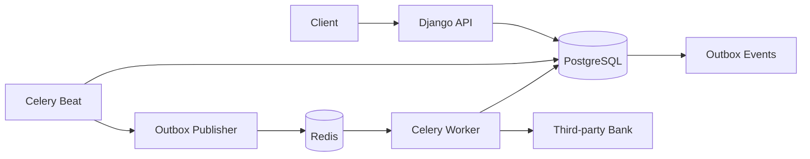

# Toman Wallet Service

A Django wallet-service coding challenge implementation with safe deposits, future-dated withdrawals, PostgreSQL accounting constraints, Celery background execution, a transactional outbox, request idempotency, fund reservation, retries, and manual reconciliation support.

## Quick start

```bash
cp .env.example .env
docker compose up --build
```

The stack starts:

- Django API at `http://localhost:8000`
- provided bank simulator at `http://localhost:8010`
- PostgreSQL
- Redis
- Celery worker
- Celery Beat, which runs both the due dispatcher and outbox publisher

Apply migrations and run tests:

```bash
docker compose exec wallet python manage.py migrate
docker compose exec wallet python manage.py test wallets
```

View background-process logs:

```bash
docker compose logs -f worker beat
```

## API

All money values are integer minor units. Authentication is intentionally out of scope.

| Method | Endpoint | Description |
| --- | --- | --- |
| `POST` | `/wallets/` | Create a wallet. |
| `GET` | `/wallets/{wallet_uuid}/` | Read total, reserved, and available balances. |
| `POST` | `/wallets/{wallet_uuid}/deposit` | Deposit `{"amount": 100}`. |
| `POST` | `/wallets/{wallet_uuid}/withdraw` | Schedule `{"amount": 100, "execute_at": "2026-07-18T12:00:00Z"}`. |
| `GET` | `/wallets/withdrawals/{withdrawal_uuid}/` | Read withdrawal state and result metadata. |

Deposits and withdrawal scheduling accept an `Idempotency-Key` header. Replaying the same key and body returns the stored response without repeating the operation; using the key with a different body returns `409 Conflict`.

Example:

```bash
curl -X POST http://localhost:8000/wallets/WALLET_UUID/deposit \
  -H 'Content-Type: application/json' \
  -H 'Idempotency-Key: deposit-001' \
  -d '{"amount":100}'
```

## Architecture

PostgreSQL is the source of truth. Beat claims due withdrawals with `FOR UPDATE SKIP LOCKED`, changes them to `queued`, and creates an outbox event in the same transaction. A periodic publisher sends unpublished events to Redis/Celery. Workers reserve funds in a short transaction, call the bank without database locks, and then settle, release, retry, or retain the reservation in another transaction.



Detailed documentation:

- [Architecture, state machine, transaction boundaries, and operations](docs/architecture.md)
- [Editable multi-page Draw.io diagrams](docs/wallet-architecture.drawio)
- [Wallet application notes](wallet/readme.md)
- [Provided bank simulator contract](third-party/readme.md)

## Accounting and reliability guarantees

```text
available_balance = balance - reserved_balance
```

The database enforces non-negative balances, non-negative reservations, reservations no greater than total balance, positive transaction amounts, unique withdrawal ledger operations, unique bank-attempt numbers, and unique API idempotency keys per operation.

Task delivery is at-least-once. Duplicate tasks are made safe through explicit withdrawal states, row locks, stable internal bank idempotency keys, and ledger uniqueness constraints. Outbox events remain stored for audit and publisher retry.

## Configuration

See [.env.example](.env.example) for all supported variables. Production requires `DJANGO_SECRET_KEY`; `DJANGO_DEBUG` defaults to false. Database, Redis, bank URL/timeouts, dispatcher intervals and batch sizes, retry policy, allowed hosts, request-size limit, and logging level are environment-controlled.

## Operational commands

```bash
# Manually process due withdrawals
docker compose exec wallet python manage.py process_due_withdrawals

# List withdrawals requiring manual reconciliation
docker compose exec wallet python manage.py reconcile_withdrawals
```

## Known limitations

- Authentication and authorization are not part of the challenge.
- The supplied bank has no idempotency-key support, external transaction ID, or status lookup.
- Ambiguous bank outcomes can therefore require manual reconciliation; exact-once external payout cannot be guaranteed.
- There is no transaction-history endpoint or pagination API.
- PostgreSQL is required for production locking semantics; SQLite is only a local test/development fallback.
