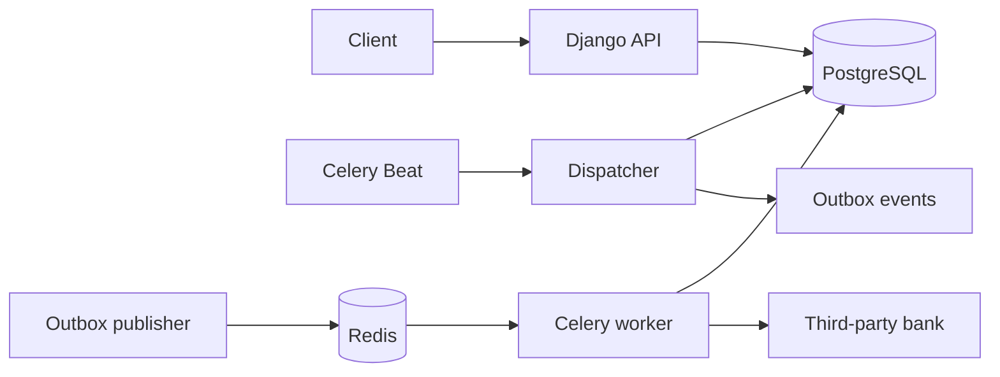
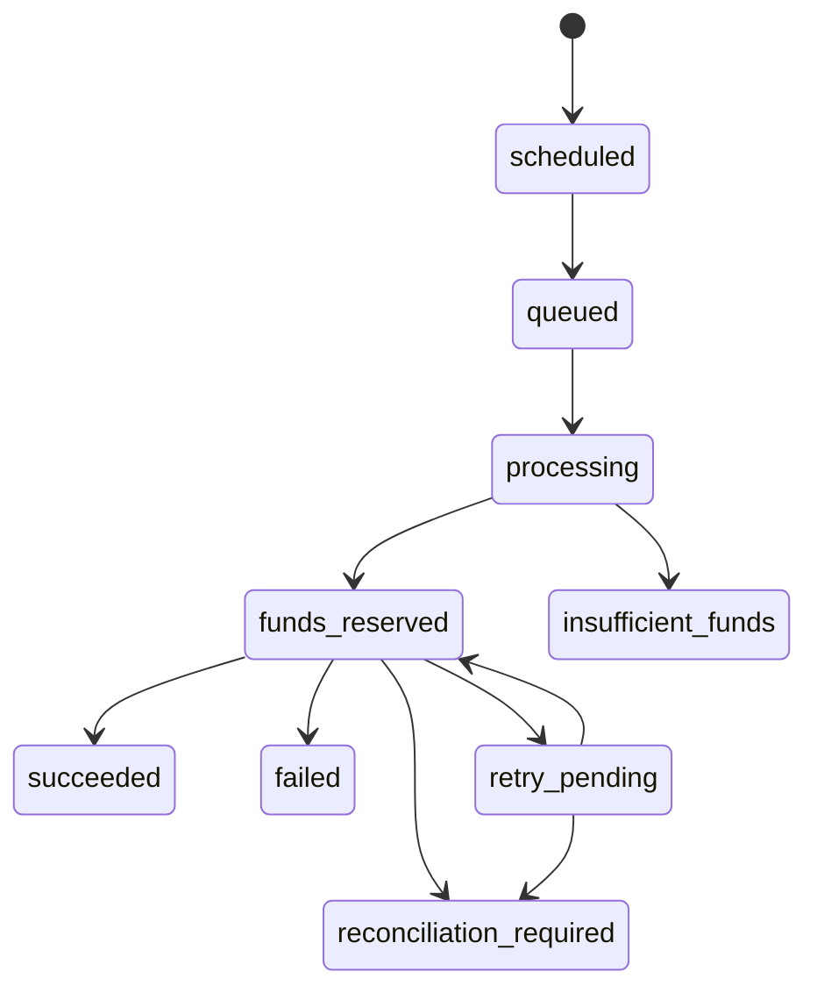

# Wallet Service Architecture

## Big picture

The wallet service is a Django API backed by PostgreSQL. It keeps the financial state and workflow state in the database; Redis and Celery provide asynchronous delivery, not the source of truth. The supplied Flask bank service is an external dependency.



## Core data model

`Wallet` stores `balance` and `reserved_balance`; `available_balance` is `balance - reserved_balance`. Database checks require both balances to be non-negative and the reservation never to exceed the balance.

`Withdrawal` is the durable workflow record. It has an immutable bank idempotency UUID, retry fields, an explicit state, and bank-attempt history. `Transaction` is the financial ledger. Its `(withdrawal, operation)` uniqueness constraint prevents a repeated worker from recording a second reservation, release, or settlement.

`ApiIdempotency` retains the normalized request hash and original safe response for deposits and withdrawal scheduling. `OutboxEvent` retains task-publication work until it has been published.

## API flow

1. A client sends a deposit or schedule-withdrawal request, optionally with `Idempotency-Key`.
2. Django hashes the normalized payload and looks up the key scoped by operation.
3. A matching key and hash replays the original response; a different hash returns `409 Conflict`.
4. A first request executes within a transaction and persists its response for later replay.

## Automatic withdrawal flow

1. Beat runs the dispatcher periodically.
2. The dispatcher selects due `scheduled` or retry-due `retry_pending` withdrawals with `FOR UPDATE SKIP LOCKED`.
3. It moves each to `queued` and creates an `OutboxEvent` in the same transaction.
4. The publisher locks unpublished events, publishes a Celery task, then writes `published_at`. A publication failure retains the event and schedules its next attempt.
5. The worker locks the withdrawal first and the wallet second. It reserves available funds and commits.
6. The bank call happens outside all database locks.
7. A second short transaction settles the reservation on success, releases it for confirmed failure, or retains it for retry/ambiguity.

## Withdrawal states



Terminal states (`succeeded`, `failed`, and `insufficient_funds`) are never reopened.

## Reliability boundaries

- PostgreSQL is authoritative for balances, workflow state, idempotency records, attempts, and outbox events.
- Worker delivery is at-least-once. State checks plus unique ledger operations make duplicate tasks harmless for internal financial effects.
- Bank calls cannot be made exactly once because the provided service does not support idempotency keys or status lookup. Ambiguous results retain funds and ultimately require reconciliation.
- Lock order is always withdrawal → wallet → ledger, allowing unrelated wallets to progress independently.

## Operations

```bash
docker compose up --build
docker compose logs -f worker beat
docker compose exec wallet python manage.py migrate
docker compose exec wallet python manage.py test wallets
```

The editable Draw.io view is [wallet-architecture.drawio](wallet-architecture.drawio).
