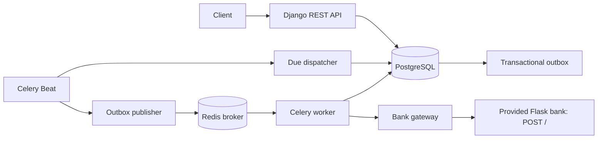
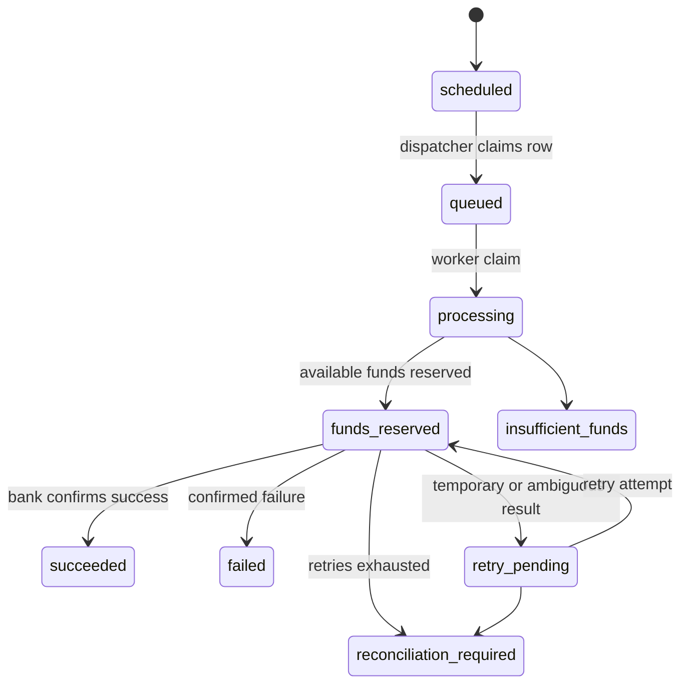

# Wallet Service: Architecture and Operational Flows

## Purpose

This service lets clients create wallets, deposit integer minor units, schedule withdrawals, and execute withdrawals asynchronously through the supplied third-party bank simulator. Authentication and destination-account data are outside this challenge's scope.

## Component architecture



| Component | Responsibility |
| --- | --- |
| Django API | Request validation, serialization, HTTP response and API idempotency replay. |
| Application services | Deposits, withdrawal scheduling, reservation, bank-attempt recording, and settlement. |
| PostgreSQL | Source of truth for accounting, workflow, API idempotency, attempts, and outbox events. |
| Celery Beat | Runs the due dispatcher and outbox publisher at the configured interval. |
| Redis | Celery broker/result backend; never an accounting source of truth. |
| Celery worker | At-least-once consumer that invokes the independently testable withdrawal service. |
| Bank gateway | Normalizes the supplied bank's actual HTTP response into application outcomes. |

The editable component view is [wallet-architecture.drawio](wallet-architecture.drawio).

## Project structure

```text
wallet/
  banking/client.py                 bank gateway and normalized result
  wallet/                           Django settings and Celery app
  wallets/models.py                 durable state and database constraints
  wallets/services/                application services
  wallets/tasks.py                 thin Celery task entrypoints
  wallets/management/commands/     operational commands
  wallets/tests.py                  unit/application tests
docs/                               this guide and Draw.io diagram
third-party/                        supplied Flask bank simulator
```

## Accounting model

All amounts are integer minor units. A wallet has:

```text
available_balance = balance - reserved_balance
```

Database constraints enforce:

- `balance >= 0`
- `reserved_balance >= 0`
- `reserved_balance <= balance`
- positive transaction and withdrawal amounts

The financial ledger (`Transaction`) records deposits, reservations, reservation releases, and completed withdrawals. `(withdrawal, operation)` is unique, so duplicate worker delivery cannot create a second financial effect.

## API

| Method | Endpoint | Result |
| --- | --- | --- |
| `POST` | `/wallets/` | Create a zero-balance wallet. |
| `GET` | `/wallets/{wallet_uuid}/` | Return balance, reserved balance, and available balance. |
| `POST` | `/wallets/{wallet_uuid}/deposit` | Deposit `{"amount": 100}`. |
| `POST` | `/wallets/{wallet_uuid}/withdraw` | Schedule `{"amount": 100, "execute_at": "2026-07-18T12:00:00Z"}`. |
| `GET` | `/wallets/withdrawals/{withdrawal_uuid}/` | Return withdrawal status and failure/retry information. |

Datetimes are timezone-aware ISO 8601 values. Input validation returns stable error codes such as `invalid_amount`, `invalid_execute_at`, and `idempotency_key_conflict`.

### API idempotency

`POST` deposit and schedule-withdrawal requests accept `Idempotency-Key`.

1. The service stores a SHA-256 hash of the normalized request body, operation name, response status, and safe response body.
2. Reusing the same key with the same operation and body returns the original response without repeating work.
3. Reusing it with a different body returns `409 Conflict`.

Keys are globally scoped per operation type in this implementation. The database uniqueness constraint ensures one winning request under concurrent submissions.

## Withdrawal workflow



`succeeded`, `failed`, and `insufficient_funds` are terminal and are never reopened.

### Successful withdrawal sequence

```mermaid
sequenceDiagram
  participant Beat
  participant DB as PostgreSQL
  participant Pub as Outbox publisher
  participant Worker
  participant Bank
  Beat->>DB: claim due row with FOR UPDATE SKIP LOCKED
  Beat->>DB: queued + OutboxEvent in one transaction
  Pub->>DB: lock unpublished outbox event
  Pub->>Worker: publish process_withdrawal
  Pub->>DB: set published_at
  Worker->>DB: lock withdrawal then wallet; reserve funds
  Worker->>Bank: POST / outside DB transaction
  Bank-->>Worker: success
  Worker->>DB: lock withdrawal then wallet; debit and release reservation
```

## Transactions, locks, and concurrency

Financial operations use `transaction.atomic`. Withdrawal flows lock rows in one consistent order:

1. withdrawal;
2. wallet;
3. related ledger/attempt rows.

The reservation transaction commits before the external call. Settlement/release occurs in another short transaction. No network request happens while a database lock is held. Deposits lock the wallet row, preventing lost updates. Dispatcher and publisher batches use PostgreSQL `FOR UPDATE SKIP LOCKED`, allowing different wallets and batches to progress in parallel.

## Scheduling and transactional outbox

Beat invokes two periodic Celery tasks:

- `wallets.dispatch_due_withdrawals` claims due `scheduled` withdrawals and retry-due `retry_pending` withdrawals, changes them to `queued`, and writes an `OutboxEvent` in the same transaction.
- `wallets.publish_outbox` publishes each unpublished event to Celery and then records `published_at`. Publishing failures keep the event and set `next_attempt_at`.

Outbox events are retained for audit. Publication and Celery delivery are at-least-once; consumer idempotency comes from terminal-state checks, stable withdrawal bank key, unique attempts, and unique ledger operations.

## Bank contract, failure classification, and retry

The supplied bank implements only `POST /`. It returns JSON `{"data":"success","status":200}` or its temporary failure form `{"data":"failed","status":503}`. It does not accept an idempotency key, return a transfer identifier, or offer a status-lookup endpoint.

| Gateway outcome | Effect |
| --- | --- |
| Success | Debit balance and clear reservation once. |
| Confirmed failure | Release reservation and mark failed. |
| Retryable failure | Keep funds reserved, set `retry_pending`, and calculate exponential backoff. |
| Ambiguous failure | Keep funds reserved; retry using the same internal key, then require reconciliation on exhaustion. |

Every withdrawal has a permanent `bank_idempotency_key`. `BankTransferAttempt` records the attempt number and key. The key cannot be sent to this provider because its real contract has no supported header/body mechanism.

Retry delay is bounded exponential backoff using `BANK_RETRY_BASE_SECONDS`, `BANK_RETRY_MAX_SECONDS`, and `BANK_MAX_RETRIES`.

## Recovery and reconciliation

Stale queued withdrawals return to `scheduled` after `WITHDRAWAL_MAX_QUEUED_AGE_SECONDS` so they can be dispatched again. Retryable reserved withdrawals remain reserved until a final response or reconciliation decision.

```bash
python wallet/manage.py reconcile_withdrawals
```

This command lists `reconciliation_required` withdrawals. It intentionally does not mutate them because the supplied bank has no status lookup; manual evidence is needed to decide between settlement and release.

## Configuration

Copy `.env.example` to `.env` for development. In production `DJANGO_SECRET_KEY` is required and `DJANGO_DEBUG` defaults to `false`.

| Variable | Purpose |
| --- | --- |
| `DATABASE_URL` | PostgreSQL connection URL; SQLite is only the local fallback. |
| `REDIS_URL` | Celery broker/result backend. |
| `BANK_SERVICE_URL`, `BANK_SERVICE_TIMEOUT_SECONDS` | Fixed configured bank endpoint and timeout. |
| `DISPATCHER_INTERVAL_SECONDS`, `WITHDRAWAL_DISPATCH_BATCH_SIZE` | Periodic claim cadence and batch size. |
| `WITHDRAWAL_MAX_QUEUED_AGE_SECONDS` | Queued-state recovery threshold. |
| `BANK_RETRY_BASE_SECONDS`, `BANK_RETRY_MAX_SECONDS`, `BANK_MAX_RETRIES` | Retry policy. |
| `DJANGO_ALLOWED_HOSTS`, `DJANGO_MAX_REQUEST_BYTES`, `LOG_LEVEL` | HTTP and operational safety settings. |

## Running and testing

```bash
docker compose up --build
docker compose exec wallet python manage.py migrate
docker compose exec wallet python manage.py test wallets
docker compose logs -f worker beat
docker compose exec wallet python manage.py reconcile_withdrawals
```

The test suite covers deposits, scheduling, execution-time funds checks, reservation release, competing withdrawals, duplicate task safety, retry key reuse, dispatcher batching/recovery, and API idempotency replay/conflict.

## Observability and future scaling

Events are logged from dispatcher and worker boundaries without logging secrets or destination data. Recommended next operational metrics are counters for withdrawal outcomes/outbox failures and latency histograms for bank calls.

The design can scale by running multiple API instances, workers, and dispatchers: PostgreSQL row locks and `SKIP LOCKED` partition work. Future work may add a bank that supports real idempotency/status lookup, JSON structured logging, a dead-letter workflow, PgBouncer, read replicas for history queries, and partitioning of large transaction tables.

## Known limitations

- No authentication/authorization.
- No transaction-history API or pagination endpoint.
- The simulator cannot prove an ambiguous payment outcome; manual reconciliation is required.
- There is no transactional outbox retry backoff beyond the configured next-attempt timestamp, no automatic reconciliation, and no bank-side exactly-once payout guarantee.
